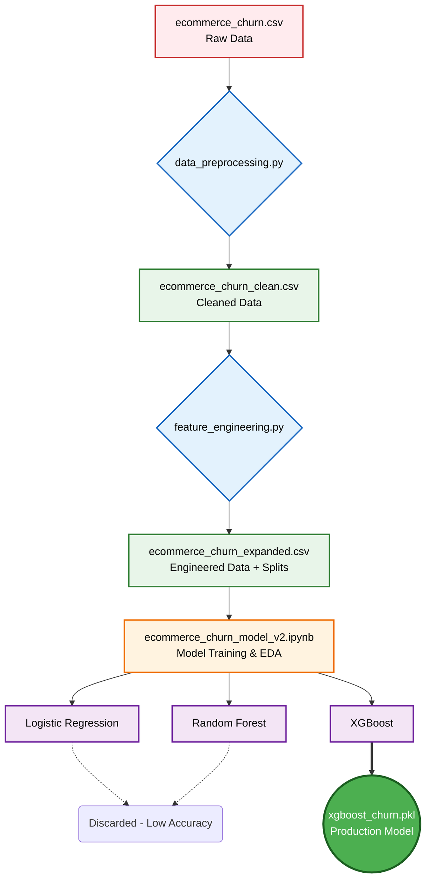

# 🤖 AI Customer Churn Prediction Pipeline

Welcome to the Machine Learning Engine of the E-Shop platform! This directory contains the complete lifecycle of our AI model—from raw data processing to the final exported model used in production.

This document serves as a guide to understanding the data pipeline, model training, and the purpose of every file in this directory.

---

## 🔄 The Machine Learning Pipeline

Our ML workflow follows a strict, modular Software Engineering approach rather than keeping everything cluttered in a single Jupyter Notebook.

---

## 🛠️ Step-by-Step Breakdown

### Step 1: Data Preprocessing 🧹
**Script:** `data_preprocessing.py`
Raw data is rarely perfect. Before feeding it to any algorithm, this script handles:
- **Missing Values:** Imputing missing data using statistical methods (mean/median/mode).
- **Outliers:** Removing anomalies that could skew the model.
- **Formatting:** Converting string data types into categorical or numeric types suitable for ML processing.
- **Output:** Generates `ecommerce_churn_clean.csv`

### Step 2: Feature Engineering ⚙️
**Script:** `feature_engineering.py`
We don't just rely on the data given to us; we create new, smarter data points.
- **New Features Created:** e.g., Combining `Total Spend` and `Account Age` to create a new `Spend Ratio` feature.
- **Encoding:** Applying One-Hot Encoding for categorical variables like Gender and Device type.
- **Splitting:** Dividing data securely into Train, Test, and Validation sets to prevent data leakage.
- **Output:** Generates `ecommerce_churn_expanded.csv` and the split CSVs (`_test.csv`, `_validation.csv`).

### Step 3: Model Training & Evaluation 🧠
**Notebook:** `ecommerce_churn_model_v2.ipynb`
This is where the actual "Data Science" happens.
1. **EDA (Exploratory Data Analysis):** Visualizing data to find hidden patterns (e.g., Do mobile users churn more than desktop users?).
2. **Algorithm Comparison:** We trained 3 different algorithms to find the best fit:
   - **Logistic Regression:** Used as our baseline model. (Saved as `logistic_regression.pkl`)
   - **Random Forest:** Used to capture non-linear relationships. (Saved as `random_forest.pkl`)
   - **XGBoost:** The winning model. Handled complex patterns with the highest accuracy and lowest false-positive rate.
3. **Hyperparameter Tuning:** Fine-tuning XGBoost parameters (depth, learning rate) for optimal performance.

### Step 4: Production Export 🚀
- **`xgboost_churn.pkl`**: The final brain of our AI. It is loaded by the Node.js backend to make real-time predictions.
- **`features_list.json`**: Acts as a bridge between Backend and ML. It tells the backend API exactly which input columns (features) the XGBoost model expects.

---

## 📂 File Directory Cheatsheet

If an interviewer asks you what a specific file does, use this quick reference:

| File Name | Category | Purpose |
| :--- | :---: | :--- |
| `ecommerce_churn.csv` | **Data** | The absolute raw dataset we started with. |
| `data_preprocessing.py` | **Script** | Cleans the raw data (handles nulls/outliers). |
| `feature_engineering.py` | **Script** | Creates new AI features and splits the data. |
| `* _clean.csv` & `* _test.csv` | **Data** | Intermediate proof that data was properly cleaned and split. |
| `ecommerce_churn_model_v2.ipynb` | **Notebook** | The core training sandbox (EDA, Training, Validation). |
| `logistic_regression.pkl` | **Model** | Baseline model (Kept to show comparative analysis). |
| `random_forest.pkl` | **Model** | Alternative model (Kept to show comparative analysis). |
| `xgboost_churn.pkl` | **Model** | The final, winning model used in production! |
| `features_list.json` | **Config** | Tells the backend API which inputs the model requires. |
| `requirements.txt` | **Config** | Python dependencies (pandas, scikit-learn, xgboost) required to run this code. |

---
*Developed for E-Shop platform's AI Customer Churn Analytics.*
